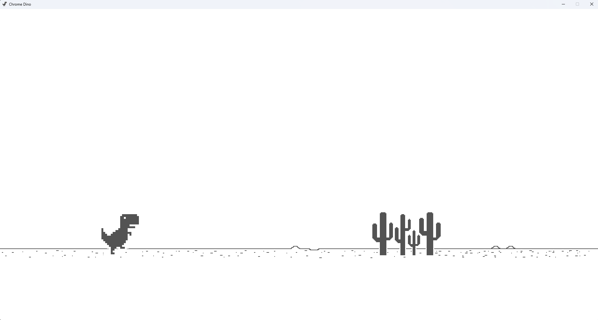

# Chrome Dinosaur Game Clone



This project aims to recreate the classic Chrome dinosaur game using Python and Pygame.


## Features

- **Dinosaur Character**: Animated character that can jump and duck.
- **Obstacles**: Randomly generated obstacles (e.g., cacti) that the dinosaur must avoid.

## TO-DO
- **Scoring**: Track and display the player's score based on survival time.
- **Game Over**: Display a game over screen when the dinosaur collides with an obstacle.
- **Sound Effects**: Optional sounds for actions like jumping, ducking, and collision.

## Installation

1. Install Python (if not already installed): [Python Installation Guide](https://www.python.org/downloads/)
2. Install Pygame:
   ```bash
   pip install -r requirements.txt
   ```
3. Run `main.py`
